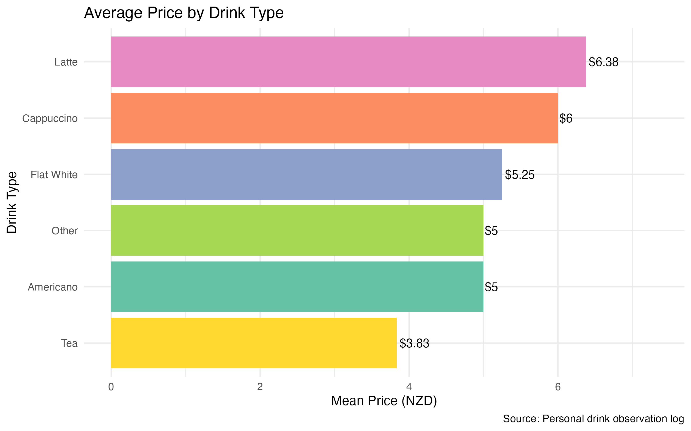
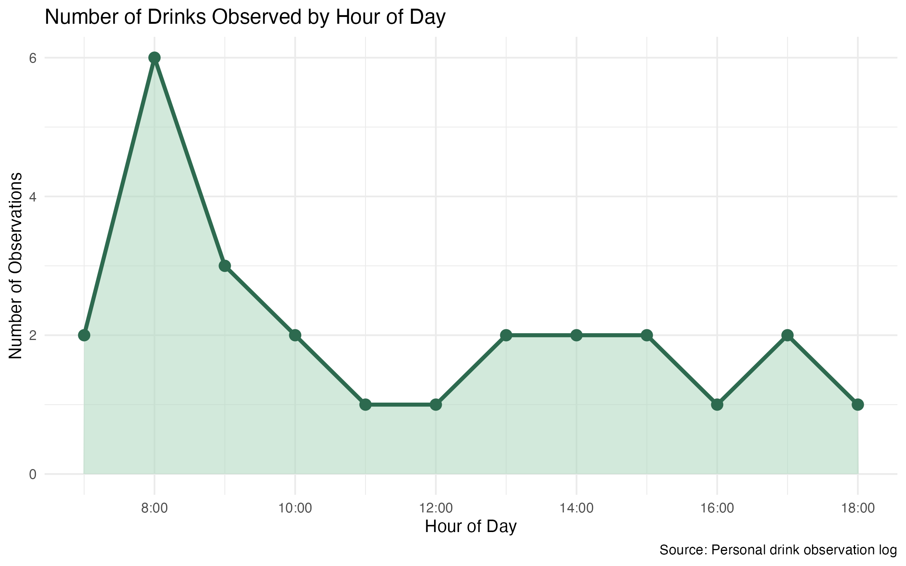
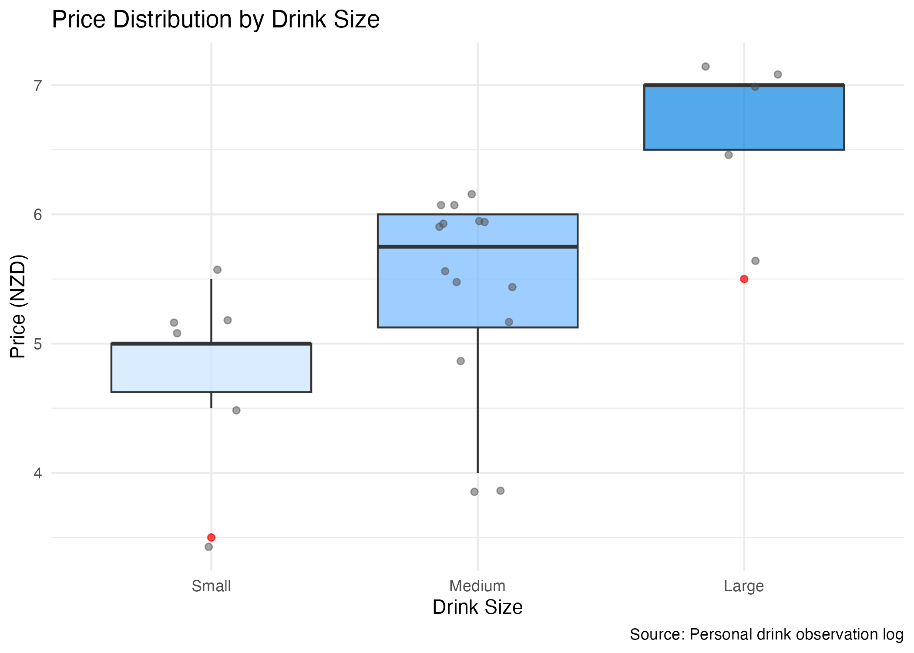

<script src="https://code.jquery.com/jquery-3.7.1.min.js" integrity="sha256-/JqT3SQfawRcv/BIHPThkBvs0OEvtFFmqPF/lYI/Cxo=" crossorigin="anonymous"></script>

```{r setup, include=FALSE}
knitr::opts_chunk$set(echo=FALSE, message=FALSE, warning=FALSE, error=FALSE)
```

```{js}
$(function() {
  $(".level2").css('visibility', 'hidden');
  $(".level2").first().css('visibility', 'visible');
  $(".container-fluid").height($(".container-fluid").height() + 300);
  $(window).on('scroll', function() {
    $('h2').each(function() {
      var h2Top = $(this).offset().top - $(window).scrollTop();
      var windowHeight = $(window).height();
      if (h2Top >= 0 && h2Top <= windowHeight / 2) {
        $(this).parent('div').css('visibility', 'visible');
      } else if (h2Top > windowHeight / 2) {
        $(this).parent('div').css('visibility', 'hidden');
      }
    });
  });
})
```

```{css}
.figcaption {display: none}

body {
  font-family: 'Georgia', serif;
  background-color: #fdf6ee;
  color: #3b2a1a;
  line-height: 1.8;
  max-width: 860px;
  margin: 0 auto;
  padding: 20px 30px;
}

h1.title {
  font-size: 2em;
  color: #5c3d1e;
  text-align: center;
  border-bottom: 3px solid #c8a97e;
  padding-bottom: 12px;
  margin-bottom: 30px;
}

h2 {
  font-size: 1.5em;
  color: #7b4f2e;
  border-left: 5px solid #c8a97e;
  padding-left: 12px;
  margin-top: 1.5em;
}

p {
  font-size: 1.05em;
  text-align: justify;
}

img {
  border-radius: 8px;
  box-shadow: 0 4px 12px rgba(0,0,0,0.12);
  display: block;
  margin: 16px auto;
  max-width: 100%;
}
```

## Every morning starts with a drink — but which one?

Every day, millions of people order a hot drink at a café. Over several weeks, I observed and logged **25 drink orders** across different times of day, recording the type, size, price, and exact timestamp of each order. This visual story explores three questions: which drinks cost the most, when do people buy them, and does size predict price?



Latte is the most expensive drink on average (~$6.50 NZD), while Tea is the most affordable (~$3.80 NZD). Milk-based espresso drinks — Latte, Cappuccino, and Flat White — all average above $5.50, suggesting that milk-based preparation consistently commands a price premium over simpler drinks like tea or Americano.

## The morning rush is very real

Using the precise timestamps from each observation, I extracted the hour of each order to see when café activity peaks throughout the day.



The 8:00 AM hour recorded **6 observations** — the highest of any hour — confirming a strong morning peak. Activity drops sharply after 9 AM and stays low through the afternoon. Over 40% of all observed orders occurred before 9 AM, highlighting just how concentrated café demand is in the early morning window.

## Size matters — but so does what you order

Finally, I explored whether drink size is a reliable predictor of price by comparing the price distributions across Small, Medium, and Large drinks.



Size and price are clearly positively associated — larger drinks are consistently more expensive. However, the outliers (red dots) tell an interesting story: a Small drink priced as low as ~$3.50 and a Large drink priced at ~$5.50 show that **drink type can override size as a pricing factor**. A large tea is still cheaper than a small latte, reinforcing the finding from the first chart that the type of drink matters just as much as its size.
